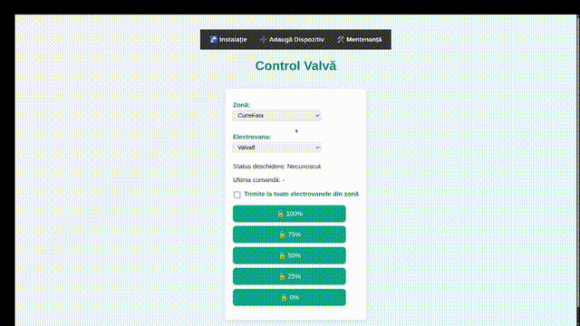

## Table of contents

1. [Project overview & workflow](#project-overview--workflow)   
2. [Key components](#key-components)  
   - [MicroPico (Pico) firmware](#micropico-pico-firmware)  
   - [Flask server (PWA backend)](#flask-server-pwa-backend)  
   - [PWA frontend (static files)](#pwa-frontend-static-files)  
3. [REST API & usage examples](#rest-api--usage-examples)  
4. [Setup & installation](#setup--installation)  
   - [Prerequisites](#prerequisites)  
   - [Server (Flask) setup](#server-flask-setup)  
   - [Deploying MicroPico firmware](#deploying-micropico-firmware)  
   - [Running and accessing the PWA](#running-and-accessing-the-pwa)  
5. [Troubleshooting & tips](#troubleshooting--tips)  
6. [License & author](#license--author)  



# Project overview & workflow

This project provides a browser-based PWA to control motorized [Daver HL2102](https://daver.ro/produs/vana-2-cai-rotativa-1-cu-servomotor-rapid-220v-50hz-cu-control-automat-manual-daver/?v=aa5be4aa14fa&_gl=1*1p9jwe2*_up*MQ..*_gs*MQ..&gclid=CjwKCAjwuePGBhBZEiwAIGCVS-pATOar8Zf5VQ3p2BTXAoGa9GbjMpXnGP-oIoqFOKmJA7mdYQ-YFxoCR14QAvD_BwE&gbraid=0AAAAACToJv3zmC5FB-m_Z1t0GNeLMUllQ) valves using a Raspberry Pi Pico running MicroPython.

**Hardware + software workflow**

1. User interacts with the PWA in their browser (dashboard, add device,graph editor, maintenance page).  
2. PWA sends HTTP requests to the Flask backend to set commands or modify configuration.  
3. The Pico periodically polls from the Flask server (`/get-command/<device_id>`) for pending commands.  
4. Pico executes commands by driving the appropriate relay GPIO pins (via `machine.Pin`) and helper modules that manage timing and motor logic.  
5. Pico sends status updates back to the server (`/status-report/<device_id>`) so the PWA can display real-time valve status.  
6. The Flask backend runs a background maintenance thread to schedule/trigger automatic maintenance commands.


# Key components

## MicroPico (Pico) 

- **Language:** MicroPython.  
- **Purpose:** Connects to Wi-Fi, polls Flask server for commands, drives 2 relays per valve to perform operations, sends status back to server.  
- **Command set supported:**  
  - `percent_0` (fully closed)  
  - `percent_25`  
  - `percent_50`  
  - `percent_75`  
  - `percent_100` (fully open)  
  - `maintenance` (run maintenance sequence)  
- **Helpers used:** `timefunctions.py`, `HL2102.py`, `TwoWayMotorisedValve.py` (placed in `src/pico_code/helpers/`). These modules implement precise timing, motor control abstractions and HL2102-specific behaviors.  
- **GPIO control:** Uses `machine.Pin` for relay control. Relays are toggled according to safe timing patterns (always ensure open and close relays are NOT enabled simultaneously).  
- **Features:** automatic startup (connect to Wi-Fi), periodic polling loop, automatic retry/backoff, status reporting (`HTTP POST /status-report/<device_id>`), maintenance cycle support.

## Flask server (PWA backend)

- **Purpose:** Serves the PWA (HTML + static), exposes REST API for device management, commands, flows and graph data; maintains JSON config files; runs a background thread that triggers scheduled maintenance.  
- **Routes & behavior:** (see **REST API** section below for full table)  
  - Serve pages: `/`, `/add-device-page`, `/maintenance-page`, `/graph-editor`.  
  - Graph endpoints: `/save-graph`, `/load-graph`.  
  - Flow endpoints: `/save-flows`, `/get-flows`.  
  - Device endpoints: `/devices`, `/add-device`, `/get-config/<device_id>`, `/get-devices-config`.  
  - Maintenance endpoints: `/set-maintenance`, `/get-maintenance/<device_id>`.  
  - Command endpoints: `/set-command`, `/get-command/<device_id>`.  
  - Status endpoints: `/status-report/<device_id>`, `/get-status/<device_id>`.  
  - Zone grouping endpoint: `/zones-devices`.  
- **Background maintenance thread:** `maintenance_worker()` periodically checks `device_configs` for enabled maintenance and schedules `active_commands[device_id] = "maintenance"` when appropriate. When set, the Pico will pick it up on its next poll. The worker writes `json_files/config.json` with updated `last_maintenance_date`.  
- **Persistence:** JSON files in `json_files/` (`config.json`, `flow_data.json`, `graph_data.json`, `zone_groups.json`) keep persistent state across restarts.

## PWA frontend (static files)

- **Pages:** `index.html` (dashboard), `add_device.html`, `maintenance.html`, `graph.html`.  
- **JS entry points:** `static/javascript_files/index.js` (app logic), `common.js`, `graph_logic.js`, `maintenance.js`, `worker.js` (service worker logic).  
- **PWA features:** installable icons are in `static/icons/` (`icon-192.png`, `icon-512.png`); `worker.js` registers service worker and enables offline caching/behaviour.  
- **Graph editor:** `graph.html` + `graph_logic.js` uses Drawflow (or similar) to compose installation graphs and store graph data to `json_files/graph_data.json` via the Flask Graph API endpoints.


# REST API & usage examples

Below are the most important endpoints (based on `app.py`) and examples.

## Important endpoints summary

| Endpoint | Method | Purpose |
||:||
| `/` | GET | Serve `index.html` |
| `/add-device-page` | GET | Serve `add_device.html` |
| `/maintenance-page` | GET | Serve `maintenance.html` |
| `/graph-editor` | GET | Serve `graph.html` |
| `/save-graph` | POST | Save graph JSON to `graph_data.json` |
| `/load-graph` | GET | Load graph JSON |
| `/save-flows` | POST | Append a new flow to `flow_data.json` |
| `/get-flows` | GET | Get flows |
| `/devices` | GET | Return `device_configs` |
| `/add-device` | POST | Add new device config |
| `/get-config/<device_id>` | GET | Get single device config |
| `/set-maintenance` | POST | Set maintenance config for a device |
| `/get-maintenance/<device_id>` | GET | Get maintenance config |
| `/set-command` | POST | Set a command for a device (`percent_*`) |
| `/get-command/<device_id>` | GET | Pico polls this to fetch and pop the command |
| `/status-report/<device_id>` | POST | Pico posts status updates here |
| `/get-status/<device_id>` | GET | Get last reported status |
| `/zones-devices` | GET | Return devices grouped by zone (reads config file) |


# Setup & installation

## Prerequisites

- **For Flask server (backend / PWA):**
  - Python 3.8+ (recommended)
  - `pip`
  - packages in `requirements.txt` (Flask, Flask-CORS, etc.)
- **For MicroPico (Raspberry Pi Pico w/ MicroPython):**
  - Raspberry Pi Pico W (or Pico with Wi-Fi-capable board)
  - MicroPython firmware flashed on Pico
  - USB cable, Thonny or `mpremote`/`rshell` to upload files
- **Network:**
  - Pico and Flask server must be on the same network (or server reachable by Pico).
  - If using different subnets/routers, ensure server IP is reachable from Pico.


## Server (Flask) setup

1. Create a Python virtual environment (recommended):

```bash
python -m venv .venv
source .venv/bin/activate   # Linux / macOS
# .venv\Scripts\activate    # Windows PowerShell
```

2. Install requirements:

```bash
pip install -r requirements.txt
```

3. Ensure `json_files/` exists and contains `config.json` (can be `{}` initially), `flow_data.json` (empty list `[]`), `graph_data.json` (empty object `{}`) — otherwise `app.py` will create/handle missing files.

4. Run the Flask server:

```bash
python app.py
```

The server listens by default on `0.0.0.0:5000`. Open `http://<server-ip>:5000/` in a browser to access the PWA.


## Deploying MicroPico firmware

For more information check the [documentation](src/pico_code/README.md)


# Troubleshooting & tips

**Common issues & fixes**

- **Pico cannot connect to Wi-Fi**
  - Verify SSID/password and Wi-Fi signal strength.
  - Check if your network uses enterprise/WPA2-Enterprise (unsupported by basic MicroPython Wi-Fi drivers).
  - Ensure Pico has MicroPython firmware that supports Wi-Fi (Pico W).

- **Pico cannot reach server**
  - Confirm server IP & port reachable from Pico network.
  - Test with another device on same network: `curl http://<server-ip>:5000/get-flows`.

- **Web UI not updating status**
  - Ensure Pico posts status to `/status-report/<device_id>`.
  - Check `device_configs` in `json_files/config.json` — the Flask server stores the last status under each device's `status` field.

**Debugging tips**

- Use `print()` extensively on Pico and tail server logs to track behavior.
- Use the `/get-command/<device_id>` API manually to confirm the server is queuing commands.

# Components used
- [Raspberry Pi Pico 2 W](https://www.optimusdigital.ro/ro/placi-raspberry-pi/13327-raspberry-pi-pico-2-w.html?gad_source=1&gad_campaignid=21513560576&gbraid=0AAAAADv-p3CU-PLFQwxwHuiuYJQon4rGX&gclid=CjwKCAjwuePGBhBZEiwAIGCVS93CHnhbC7t8p5DBO7dXEJRym2Kuq5aK0ylKGP6mrM7LxVywRjis0hoC6NsQAvD_BwE) 
- A pair of [relays](https://www.optimusdigital.ro/ro/electronica-de-putere-module-cu-releu/39-modul-cu-releu-cu-doua-canale.html?search_query=rele&results=690)
- Two way motorised valve ([Daver HL2102](https://daver.ro/produs/vana-2-cai-rotativa-1-cu-servomotor-rapid-220v-50hz-cu-control-automat-manual-daver/?v=aa5be4aa14fa&_gl=1*1p9jwe2*_up*MQ..*_gs*MQ..&gclid=CjwKCAjwuePGBhBZEiwAIGCVS-pATOar8Zf5VQ3p2BTXAoGa9GbjMpXnGP-oIoqFOKmJA7mdYQ-YFxoCR14QAvD_BwE&gbraid=0AAAAACToJv3zmC5FB-m_Z1t0GNeLMUllQ))


# License & author

- License: MIT
- Author: Cernea Mihnea-Ioan


